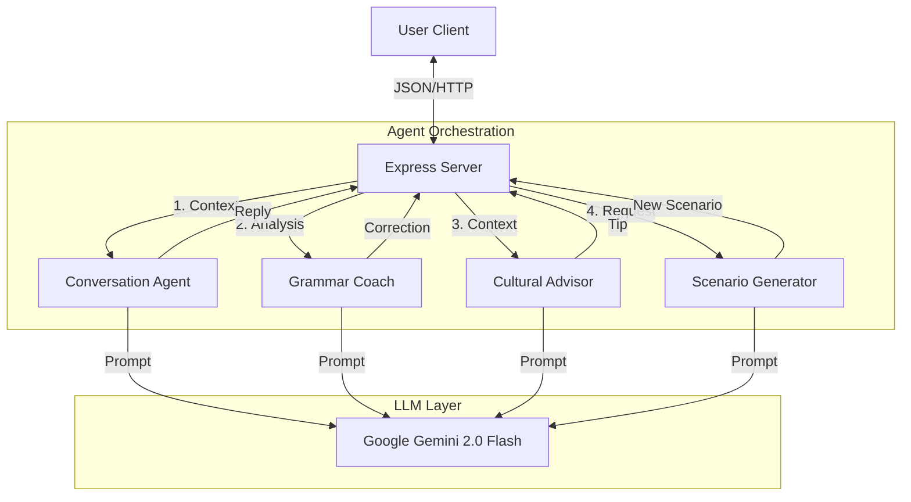

# Lingua Flow - AI Conversation Partner

A multi-agent language learning application built for the Google AI Agents Course Capstone.

## Features

- **Multi-Agent Architecture**:
  - **Conversation Partner**: Engages in natural dialogue.
  - **Grammar Coach**: Provides real-time corrections in your native language.
  - **Cultural Advisor**: Offers cultural insights relevant to the conversation.
  - **Scenario Generator**: Creates immersive roleplay situations.
- **Multi-Language Support**:
  - **Native Languages**: English, French, German, Japanese, Traditional Chinese, Cantonese.
  - **Target Languages**: English, French, German, Japanese, Traditional Chinese, Cantonese.
- **Memory**: Remembers user profile and conversation history.

## Prerequisites

- Node.js (v18+)
- Google Gemini API Key

## Setup

1.  Clone the repository (or navigate to the directory).
2.  Install dependencies:
    ```bash
    npm install
    ```
3.  Create a `.env` file in the root directory and add your API Key:
    ```env
    GEMINI_API_KEY=your_api_key_here
    PORT=3000
    ```

## Running the Application

1.  **Development Mode**:
    ```bash
    npm run dev
    ```
2.  **Production Build**:
    ```bash
    npm run build
    npm start
    ```
3.  Open your browser to `http://localhost:3000`.

## Usage

1.  Select your **Native Language** (e.g., Cantonese) and **Target Language** (e.g., English).
2.  Click **Update** to save settings.
3.  Click **Start New Scenario** to generate a roleplay situation.
4.  Type or speak your response.
5.  Receive a reply from the partner, plus grammar corrections and cultural tips in the sidebar!

## Problem

Language learners often struggle to bridge the gap between textbook grammar and real-world conversation. They lack:
1.  **Contextual Practice**: Textbooks don't adapt to specific scenarios (e.g., "ordering street food in Taipei").
2.  **Immediate Feedback**: Tutors aren't always available to correct mistakes instantly.
3.  **Cultural Nuance**: Language is tied to culture, but most apps focus only on vocabulary.
4.  **Native Language Support**: Explanations are often in the target language, which can be confusing for beginners.

## Solution

**Lingua Flow** is an AI-powered immersive conversation partner that solves these problems using a **Multi-Agent System**:
- **Personalized Scenarios**: Generates unique roleplay situations based on user interests.
- **Native-Language Feedback**: A dedicated "Grammar Coach" explains errors in the user's *native language* (e.g., explaining English grammar in Cantonese).
- **Cultural Context**: A "Cultural Advisor" provides relevant tips (e.g., tipping etiquette, bowing) alongside the dialogue.
- **Speech Integration**: Supports voice input for realistic speaking practice.

## Architecture

The application follows a modular multi-agent architecture:



### Tech Stack
- **Backend**: Node.js + Express + TypeScript
- **AI**: Google Gemini 2.0 Flash via `@google/generative-ai`
- **Frontend**: Vanilla HTML/CSS/JS (Responsive Design)
- **Speech**: Web Speech API (Browser Native)

